## 安装
### Mac，推荐brew安装
  `brew install k6`
### Windows，推荐winget安装
- Windows 10 1709 (build 16299)，赶紧安装winget吧

  `winget install k6`
- 当然，如果WIndows 7 也可以用chocolatey安装
  
  `choco install k6`

## 简单的使用
### Hello World
- 脚本
    ```javascript
    import http from 'k6/http';
    import { sleep } from 'k6';

    export default function () {
        http.get('https://test.k6.io');
        sleep(1);
    }
    ```
#### 默认参数运行
- command
  
    `k6 run script.js`
- results

    ```shell
    (base) ➜  demo1 git:(main) ✗ k6 run script.js                        

            /\      |‾‾| /‾‾/   /‾‾/   
        /\  /  \     |  |/  /   /  /    
        /  \/    \    |     (   /   ‾‾\  
    /          \   |  |\  \ |  (‾)  | 
    / __________ \  |__| \__\ \_____/ .io

    execution: local
        script: script.js
        output: -

    scenarios: (100.00%) 1 scenario, 1 max VUs, 10m30s max duration (incl. graceful stop):
            * default: 1 iterations for each of 1 VUs (maxDuration: 10m0s, gracefulStop: 30s)


    running (00m02.7s), 0/1 VUs, 1 complete and 0 interrupted iterations
    default ✓ [======================================] 1 VUs  00m02.7s/10m0s  1/1 iters, 1 per VU

        data_received..................: 17 kB 6.2 kB/s
        data_sent......................: 438 B 161 B/s
        http_req_blocked...............: avg=1.5s     min=1.5s     med=1.5s     max=1.5s     p(90)=1.5s     p(95)=1.5s    
        http_req_connecting............: avg=292.86ms min=292.86ms med=292.86ms max=292.86ms p(90)=292.86ms p(95)=292.86ms
        http_req_duration..............: avg=218.99ms min=218.99ms med=218.99ms max=218.99ms p(90)=218.99ms p(95)=218.99ms
        { expected_response:true }...: avg=218.99ms min=218.99ms med=218.99ms max=218.99ms p(90)=218.99ms p(95)=218.99ms
        http_req_failed................: 0.00% ✓ 0        ✗ 1  
        http_req_receiving.............: avg=230µs    min=230µs    med=230µs    max=230µs    p(90)=230µs    p(95)=230µs   
        http_req_sending...............: avg=406µs    min=406µs    med=406µs    max=406µs    p(90)=406µs    p(95)=406µs   
        http_req_tls_handshaking.......: avg=1.02s    min=1.02s    med=1.02s    max=1.02s    p(90)=1.02s    p(95)=1.02s   
        http_req_waiting...............: avg=218.36ms min=218.36ms med=218.36ms max=218.36ms p(90)=218.36ms p(95)=218.36ms
        http_reqs......................: 1     0.366832/s
        iteration_duration.............: avg=2.72s    min=2.72s    med=2.72s    max=2.72s    p(90)=2.72s    p(95)=2.72s   
        iterations.....................: 1     0.366832/s
        vus............................: 1     min=1      max=1
        vus_max........................: 1     min=1      max=1

    ```
#### 模拟10个虚拟用户(VU)，连续压测30秒
- command
  
  `k6 run --vus 10 --duration 30s script.js`

- result
    ```shell
    (base) ➜  demo1 git:(main) ✗ k6 run --vus 10 --duration 30s script.js

            /\      |‾‾| /‾‾/   /‾‾/   
        /\  /  \     |  |/  /   /  /    
        /  \/    \    |     (   /   ‾‾\  
    /          \   |  |\  \ |  (‾)  | 
    / __________ \  |__| \__\ \_____/ .io

    execution: local
        script: script.js
        output: -

    scenarios: (100.00%) 1 scenario, 10 max VUs, 1m0s max duration (incl. graceful stop):
            * default: 10 looping VUs for 30s (gracefulStop: 30s)


    running (0m31.3s), 00/10 VUs, 234 complete and 0 interrupted iterations
    default ✓ [======================================] 10 VUs  30s

        data_received..................: 2.7 MB 88 kB/s
        data_sent......................: 26 kB  842 B/s
        http_req_blocked...............: avg=21.7ms   min=1µs      med=9µs      max=542.54ms p(90)=23µs     p(95)=120.94µs
        http_req_connecting............: avg=10.56ms  min=0s       med=0s       max=252.57ms p(90)=0s       p(95)=0s      
        http_req_duration..............: avg=281.96ms min=194.26ms med=250.86ms max=668.7ms  p(90)=439.76ms p(95)=487.77ms
        { expected_response:true }...: avg=281.96ms min=194.26ms med=250.86ms max=668.7ms  p(90)=439.76ms p(95)=487.77ms
        http_req_failed................: 0.00%  ✓ 0        ✗ 234 
        http_req_receiving.............: avg=25.03ms  min=16µs     med=168µs    max=387.74ms p(90)=192.92ms p(95)=219.77ms
        http_req_sending...............: avg=50.58µs  min=4µs      med=36µs     max=754µs    p(90)=81µs     p(95)=86.34µs 
        http_req_tls_handshaking.......: avg=10ms     min=0s       med=0s       max=264.32ms p(90)=0s       p(95)=0s      
        http_req_waiting...............: avg=256.88ms min=193.95ms med=246.21ms max=540.55ms p(90)=322.75ms p(95)=349.9ms 
        http_reqs......................: 234    7.485381/s
        iteration_duration.............: avg=1.3s     min=1.19s    med=1.25s    max=1.79s    p(90)=1.48s    p(95)=1.59s   
        iterations.....................: 234    7.485381/s
        vus............................: 2      min=2      max=10
        vus_max........................: 10     min=10     max=10

    ```

- 也可以讲入参定义在脚本中
    ```javascript
    import http from 'k6/http';
    import { sleep } from 'k6';

    export const options = {
        vus: 10,
        duration: '30s',
    };
    export default function () {
        http.get('http://test.k6.io');
        sleep(1);
    }
    ```
#### 模拟多测试阶段
前30秒，用户从0增涨到20。然后接下来的1分30秒，持续模拟10个用户。然后用20秒的时间，把并发用户数从10减少到0。压测完成后显示的测试结果本文后面再说。
- code
    ```javascript
    import http from 'k6/http';
    import { check, sleep } from 'k6';

    export const options = {
        stages: [
            { duration: '30s', target: 20 },
            { duration: '1m30s', target: 10 },
            { duration: '20s', target: 0 },
        ],
    };

    export default function () {
        const res = http.get('https://httpbin.org/');
        check(res, { 'status was 200': (r) => r.status == 200 });
        sleep(1);
    }
    ```
## 浏览器扩展 + Cloud
### 安装扩展
<center>
	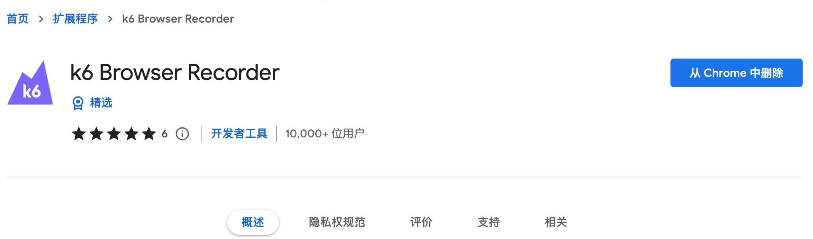
	<br>
	<div style="color:orange; border-bottom: 1px solid #d9d9d9;display: inline-block;color: #999;padding: 2px;">
	在这里插入图片注释
	</div>
</center>

### Cloud
注册app.k6.io，推荐直接用github账号登录。研发人员肯定有了github账号，测试人员从今天起也要开始写代码了，也就注册一个github吧，然后用github登录。

刚刚登录，你就能看到自己的API token，复制这个token。如果已经创建过测试工程，那就通过这个链接看到这个token：
<center>
	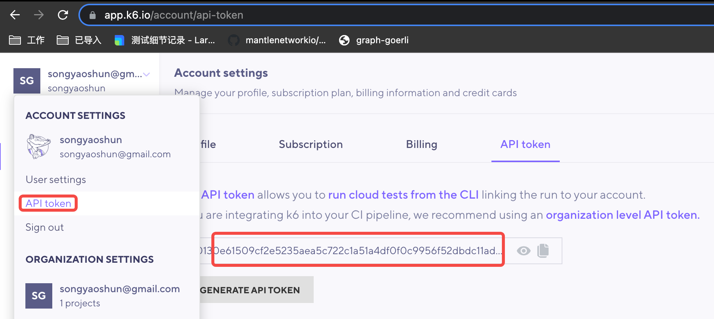
	<br>
	<div style="color:orange; border-bottom: 1px solid #d9d9d9;display: inline-block;color: #999;padding: 2px;">
	在这里插入图片注释
	</div>
</center>

### 命令行完成cloud登录
`k6 login cloud --token <YOUR_K6_CLOUD_API_TOKEN>`
```shell
(base) ➜  QA git:(main) ✗ k6 login cloud --token 5f0ff98dbc3465f61679de267eb165c2122eb1ba37f06f538eb92af38e8390bb
  token: 5f0ff98dbc3465f61679de267eb165c2122eb1ba37f06f538eb92af38e8390bb
Logged in successfully, token saved in /Users/dl00038ml/Library/Application Support/loadimpact/k6/config.json
```

### Cloud脚本录制
#### 访问http://test.k6.io
<center>
	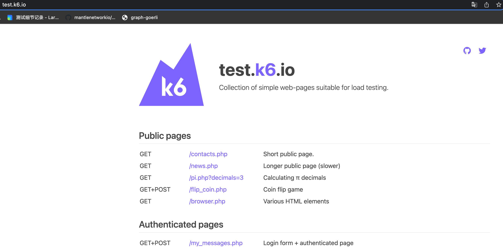
	<br>
	<div style="color:orange; border-bottom: 1px solid #d9d9d9;display: inline-block;color: #999;padding: 2px;">
	在这里插入图片注释
	</div>
</center>

#### 然后在k6的浏览器扩展这里点击 Start recording
<center>
	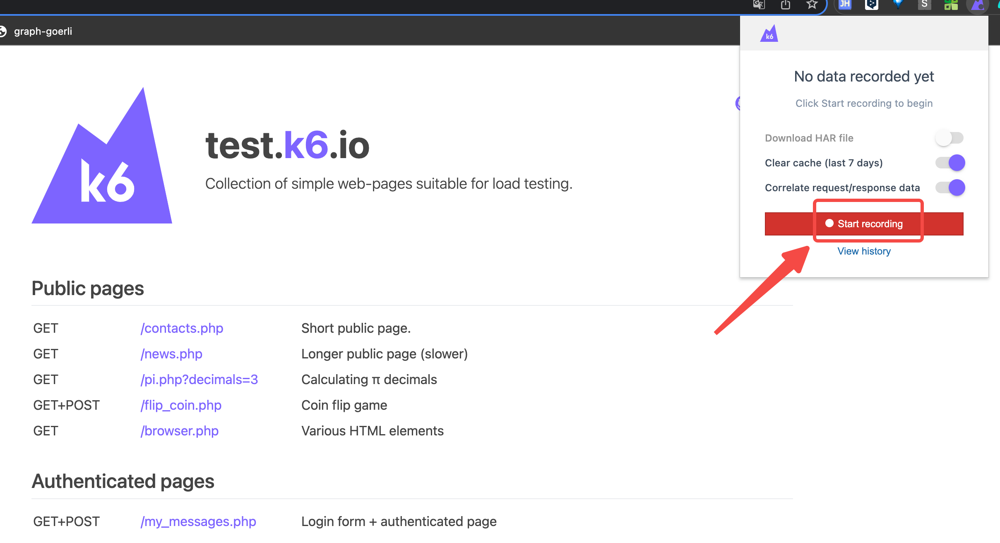
	<br>
	<div style="color:orange; border-bottom: 1px solid #d9d9d9;display: inline-block;color: #999;padding: 2px;">
	在这里插入图片注释
	</div>
</center>

#### 完成录制
点击Start recording之后，鼠标放到地址栏里回车一下就好，或者刷新一下页面，让扩展知道你操作了什么。

然后点击Stop。
这时扩展会自动打开了http://app.k6.io云端：
<center>
	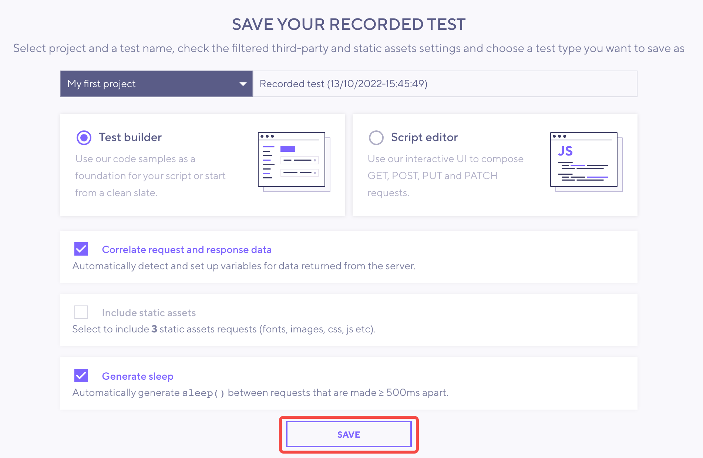
	<br>
	<div style="color:orange; border-bottom: 1px solid #d9d9d9;display: inline-block;color: #999;padding: 2px;">
	在这里插入图片注释
	</div>
</center>

点击Save。就能看到k6记录的浏览器操作了：
<center>
	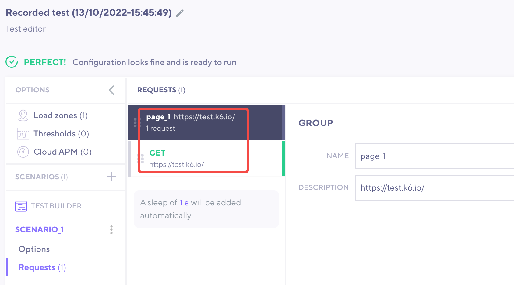
	<br>
	<div style="color:orange; border-bottom: 1px solid #d9d9d9;display: inline-block;color: #999;padding: 2px;">
	在这里插入图片注释
	</div>
</center>

#### 脚本设置
可以编辑模拟用户并发量的设置：
<center>
	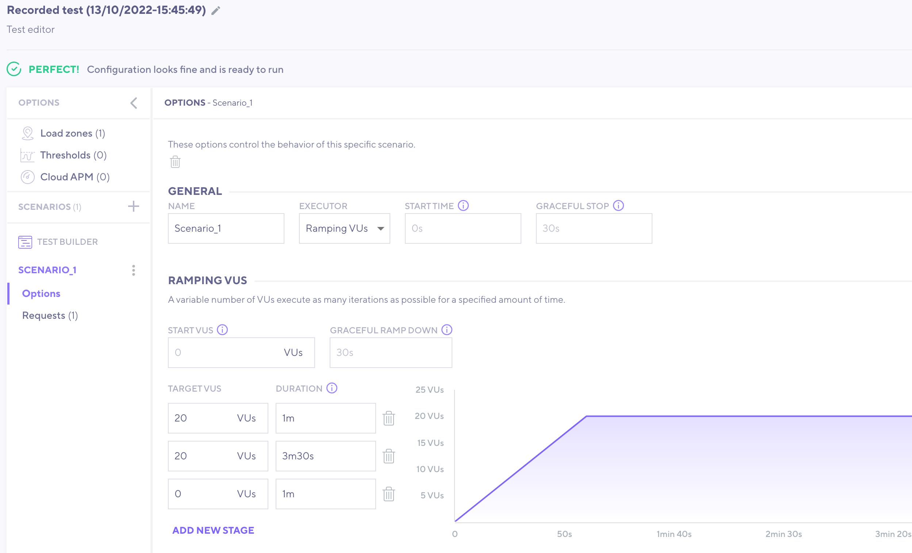
	<br>
	<div style="color:orange; border-bottom: 1px solid #d9d9d9;display: inline-block;color: #999;padding: 2px;">
	在这里插入图片注释
	</div>
</center>

上面设置就是：前1分钟，虚拟用户增长到20.然后持续3分30秒，虚拟用户维持在20个。然后1分钟内，虚拟用户减到0，完成测试。

如果，你测试的应用是公网可以访问的，那么直接云端就可以测试了，只要点击最右上角的RUN就可以了。这里我模仿一下局域网测试，这种情况多在政府或国企内网非常常见。

点击右上角的Script，然后COPY SCRIPT。

##### Cloud运行
<center>
	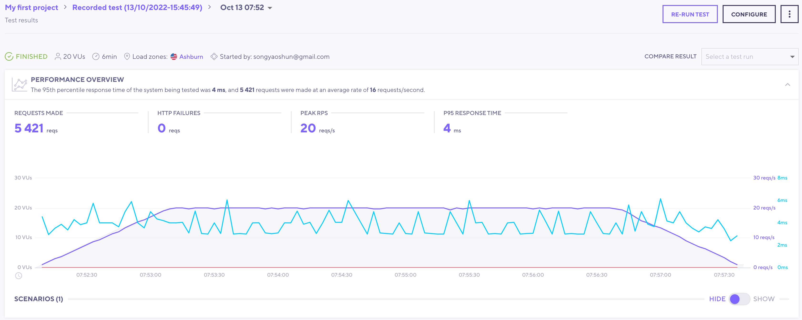
	<br>
	<div style="color:orange; border-bottom: 1px solid #d9d9d9;display: inline-block;color: #999;padding: 2px;">
	在这里插入图片注释
	</div>
</center>

###### 本地运行
- code:
<center>
	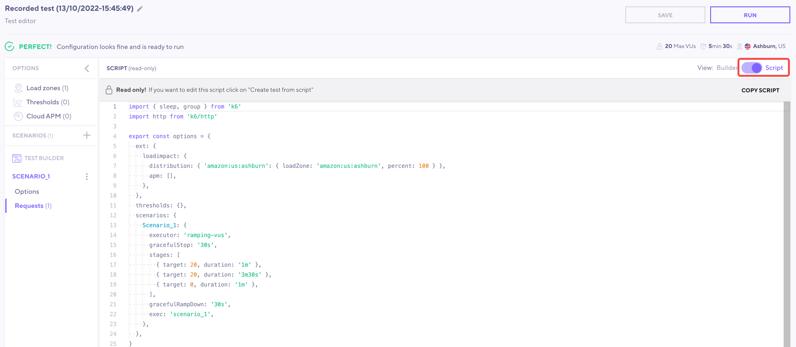
	<br>
	<div style="color:orange; border-bottom: 1px solid #d9d9d9;display: inline-block;color: #999;padding: 2px;">
	在这里插入图片注释
	</div>
</center>

- 粘贴保存到本地:
<center>
	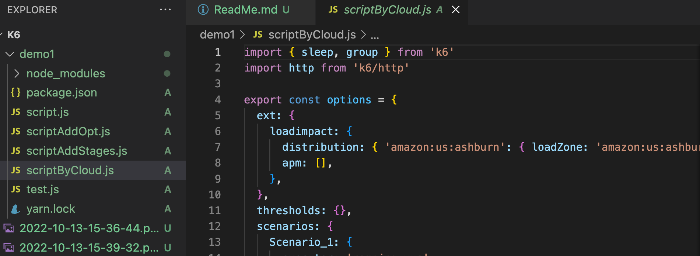
	<br>
	<div style="color:orange; border-bottom: 1px solid #d9d9d9;display: inline-block;color: #999;padding: 2px;">
	在这里插入图片注释
	</div>
</center>

- 运行命令行:

`k6 run scriptByCloud.js`
<center>
	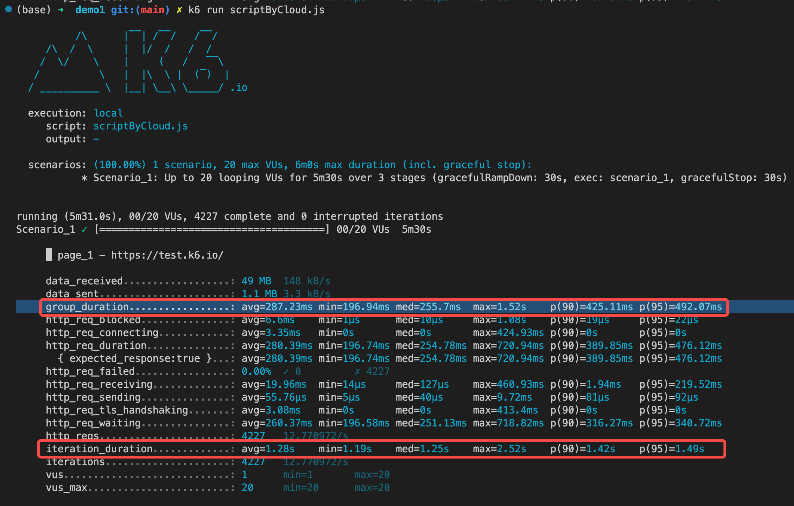
	<br>
	<div style="color:orange; border-bottom: 1px solid #d9d9d9;display: inline-block;color: #999;padding: 2px;">
	在这里插入图片注释
	</div>
</center>

上面第一个红框，显示的是综合测试指标，平均响应时间、最小响应时间、最大响应时间，p90、p95等数据。

第二个红框，显示的是每次迭代测试测数据，比上面的数据都多了1秒。因为这是模拟用户使用习惯，也就是sleep(1)，每次用户访问页面之后会停留(浏览页面)1秒。

如果我们像有更直观和可读的统计结果呢？云端不仅仅可以帮我们生成测试脚本，还可以用来帮我们分析测试结果。上面运行测试脚本的命令行稍微改一下:
```shell
k6 run --out cloud scriptByCloud.js
或简写
k6 run -o cloud scriptByCloud.js
```

因为之前通过API token，我们已经让本地程序绑定了云端。现在测试数据会实时发送到云端：
<center>
	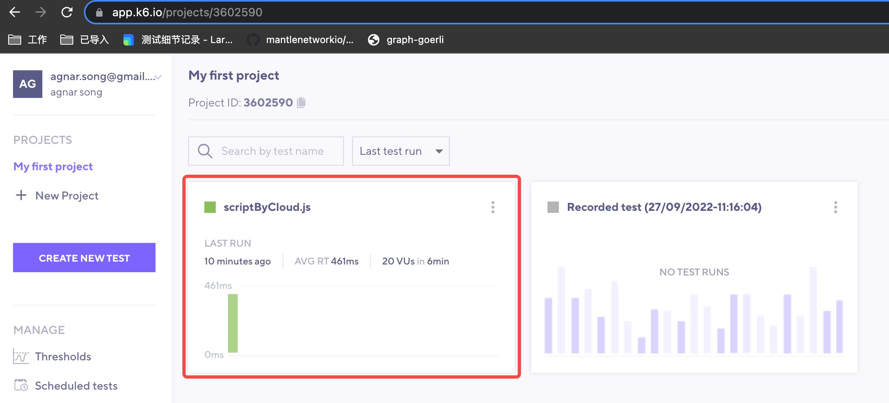
	<br>
	<div style="color:orange; border-bottom: 1px solid #d9d9d9;display: inline-block;color: #999;padding: 2px;">
	在这里插入图片注释
	</div>
</center>

测试结果如下:
<center>
	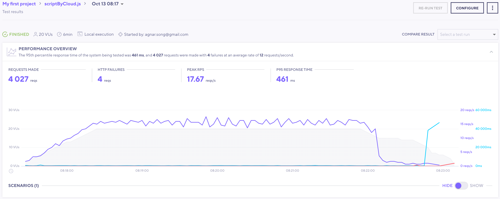
	<br>
	<div style="color:orange; border-bottom: 1px solid #d9d9d9;display: inline-block;color: #999;padding: 2px;">
	在这里插入图片注释
	</div>
</center>

整个灰色区域是VU(Virtual user)从0增长到20，然后持续3分30秒，然后再递减到0的情况。紫线是每秒请求次数，蓝线是响应时间，红线是出错率。

还可以生成测试报告：
<center>
	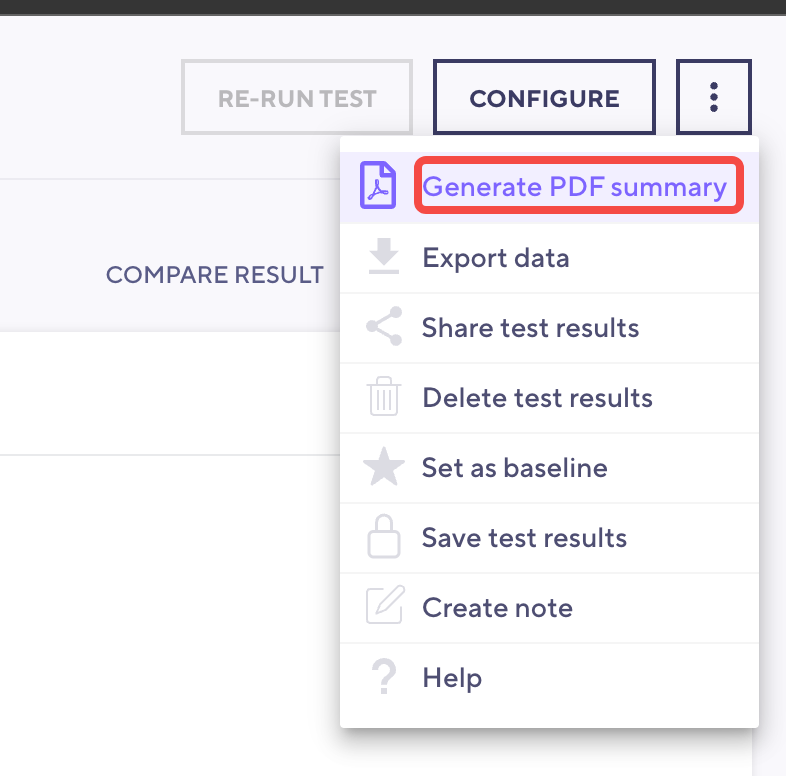
	<br>
	<div style="color:orange; border-bottom: 1px solid #d9d9d9;display: inline-block;color: #999;padding: 2px;">
	在这里插入图片注释
	</div>
</center>

<center>
	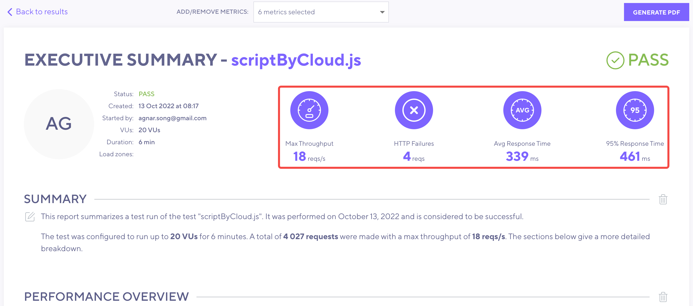
	<br>
	<div style="color:orange; border-bottom: 1px solid #d9d9d9;display: inline-block;color: #999;padding: 2px;">
	在这里插入图片注释
	</div>
</center>

对于一次压力测试来说，其实最关心的就是红框里的这几个数据了。

## 补充：本地环境搭建
[k6-面向前后端分离和微服务的压力测试](https://zhuanlan.zhihu.com/p/496092296)